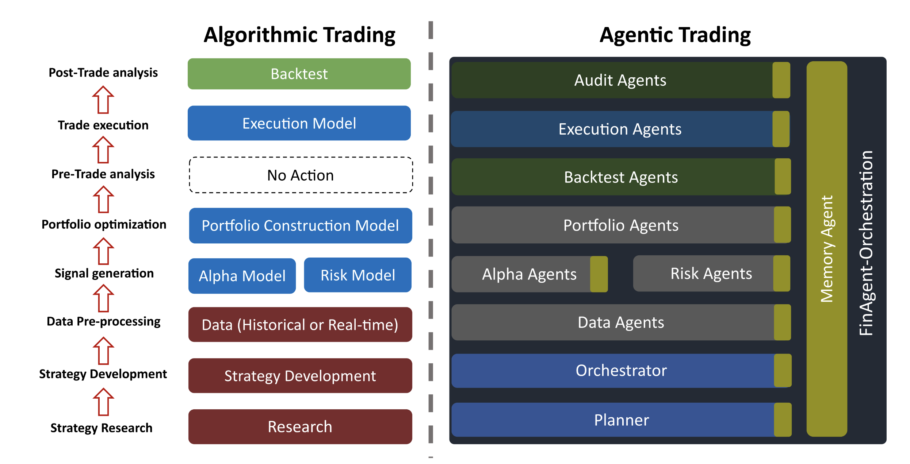

# FinAgent Orchestration: From Algorithmic Trading to Agentic Trading

<p align="center">
  
</p>

<p align="center">
  <b>Figure 1.</b> Agentic trading vs. algorithmic trading: we map the canonical AT pipeline into an interconnected network of intelligent agents within our FinAgent Orchestration Framework, where a memory agent maintains contextual continuity across tasks.
</p>

---

## 🧩 Overview

Traditional **Algorithmic Trading (AT)** frameworks decompose the investment workflow into a series of static modules—data preprocessing, signal generation, portfolio optimization, and execution. Each component operates on predefined rules and fixed data flows, limiting adaptability and cross-module learning.

In contrast, **Agentic Trading (AGT)** reframes this process as a multi-agent ecosystem. Each stage of the pipeline is embodied by autonomous agents endowed with reasoning, tool access, and memory. Agents communicate via standardized protocols (e.g., MCP, A2A) and are coordinated through a unified FinAgent Orchestrator. The orchestrator schedules, evaluates, and reflects on agent interactions, supported by a **Memory Agent** that retains historical context and performance logs.

We develop a vertically layered, protocol-oriented architecture for orchestrating autonomous FinAgents in algorithmic trading tasks. It supports real-time decision-making by dynamically composing agents through task-specific execution graphs.

At the entry point, high-level strategic queries are issued via the **Users Query** interface. These are interpreted by the **DAG Planner Agent**, which constructs a directed acyclic graph (DAG) to encode task flow. The **Orchestrator** executes the DAG, coordinating communication and execution across agent pools.

---

## 🧠 Conceptual Shift — From AT to AGT

| Dimension | Algorithmic Trading | Agentic Trading (Our Framework) |
|-----------|---------------------|----------------------------------|
| **Pipeline Structure** | Linear rule-based modules | Multi-agent graph with contextual interactions |
| **Adaptivity** | Static strategies and parameters | Agents learn and adapt across runs via memory |
| **Optimization Target** | Model-centric (single objective) | System-centric (holistic performance feedback) |
| **Coordination** | Manually configured data flows | Orchestrated via planner and DAG executor |
| **Interpretability** | Post-hoc backtest only | Continuous auditing by Audit and Evaluation Agents |

---

## 🧮 Mapping of Components

| Algorithmic Module | Corresponding Agent in FinAgent |
|-------------------|----------------------------------|
| Research & Strategy Development | Planner and Orchestrator Agents |
| Data Pre-processing | Data Agent Pool |
| Alpha / Risk Modeling | Alpha Agent Pool and Risk Agent Pool |
| Portfolio Construction | Portfolio Construction Agent Pool |
| Execution Model | Execution Agent Pool |
| Backtest / Evaluation | Backtest Agent Pool and Audit Agent Pool |
| Memory / Logging | Memory Agent (Neo4j + vector memory) |

Each agent is a self-contained LLM-powered entity with its own instruction set and tool interfaces. The **Memory Agent** acts as a shared contextual hub—storing task plans, experiment metadata, and agent feedback for continual learning.

---

## 🏗️ Framework Architecture

The architecture includes the following specialized **Agent Pools**:

### Core Infrastructure

1. **DAG Planner Agent** 
   - Generates dynamic execution plans (DAG) from high-level strategic queries
   - Decomposes complex trading tasks into coordinated agent subtasks
   - Optimizes task scheduling and resource allocation

2. **Orchestrator** 
   - Executes and monitors multi-agent tasks following the DAG plan
   - Coordinates communication across agent pools via protocol layers
   - Manages agent lifecycle, health monitoring, and error recovery

3. **Registration Bus**
   - Maintains agent registration and discovery services
   - Tracks agent health status and availability
   - Facilitates dynamic agent pool scaling

### Functional Agent Pools

4. **Data Agent Pool**
   - Acquires multi-source market data (Polygon.io, Yahoo Finance, custom feeds)
   - Performs data preprocessing, normalization, and quality validation
   - Provides real-time and historical data streams to downstream agents
   - Specializations: `YFinanceAgent`, `PolygonAgent`, `NewsAgent`, `EconAgent`

5. **Alpha Agent Pool**
   - Generates predictive signals and quantitative factors
   - Employs LLM-driven factor mining and hypothesis testing
   - Implements diverse strategies: momentum, mean-reversion, multi-factor models
   - Supports ensemble learning and adaptive window selection via reinforcement learning
   - Specializations: `MomentumAlphaAgent`, `MeanReversionAgent`, `LLMAlphaAgent`, `MultiFactorAlphaAgent`

6. **Risk Agent Pool**
   - Models portfolio exposure across systematic and idiosyncratic factors
   - Applies position-level and portfolio-level risk constraints
   - Computes Value-at-Risk (VaR), Expected Shortfall, and factor decomposition
   - Provides real-time risk monitoring and limit enforcement

7. **Transaction Cost Agent Pool**
   - Estimates market impact, slippage, and execution costs
   - Optimizes order routing and execution schedules
   - Employs multi-agent coordination for cost prediction and minimization
   - Integrates with execution models for adaptive cost control

8. **Portfolio Construction Agent Pool**
   - Optimizes portfolio weights given alpha signals, risk models, and cost estimates
   - Implements mean-variance optimization, risk parity, and Black-Litterman frameworks
   - Enforces constraints: position limits, sector exposure, turnover budget
   - Supports dynamic rebalancing and trade-off analysis

9. **Execution Agent Pool**
   - Routes and executes orders in simulated or live markets
   - Implements execution algorithms: TWAP, VWAP, adaptive strategies
   - Monitors order status and manages partial fills
   - Provides execution quality analytics

10. **Backtest Agent Pool**
    - Evaluates strategy performance over historical data
    - Computes risk-adjusted returns: Sharpe, Sortino, Calmar ratios
    - Generates tearsheets and performance attribution reports
    - Supports walk-forward analysis and parameter sensitivity testing

11. **Audit Agent Pool**
   - Performs post-trade performance analysis and auditing
    - Attributes returns to alpha, risk, and cost components
    - Identifies sources of outperformance or underperformance
   - Validates compliance with trading constraints and risk limits
   - Generates feedback for continual agent learning and system improvement

### Memory and Learning

12. **Memory Agent**
    - Maintains execution traces, model outputs, and evaluation results
    - Stores structured data in Neo4j graph database with relationship modeling
    - Provides semantic search and context retrieval via vector embeddings
    - Enables continual learning and adaptive strategy evolution
    - Supports multi-protocol interfaces: REST API, MCP, A2A

All agent pools communicate through the centralized **Memory Agent** and are coordinated by the **Orchestrator** following DAG execution plans. The **Registration Bus** ensures service discovery and health monitoring across the distributed agent ecosystem.


---

## 🔗 Communication Protocols

The system uses four protocol layers to govern inter-agent communication and coordination:

| Protocol | Full Name | Role |
|----------|-----------|------|
| **MCP** | Multi-agent Control Protocol | Task scheduling, lifecycle control, and DAG execution |
| **ACP** | Agent Communication Protocol | Agent feedback, status reporting, and result synchronization |
| **A2A** | Agent-to-Agent Protocol | Peer-to-peer DAG-executed subtask coordination and direct agent messaging |
| **ANP** | Agent Notification Protocol | Event-driven alerts and system-wide state propagation |

These protocols enable composable, interpretable, and learning-augmented multi-agent orchestration, offering a flexible foundation for intelligent trading strategy research and deployment.

---

## ⚙️ Implementation Highlights

- **Built on MCP (Model Context Protocol)**: Leverages the Model Context Protocol standard for agent-to-agent communication and tool registration
- **LLM-Powered Agents**: Each agent pool uses Large Language Models for reasoning, planning, and decision-making
- **Neo4j-Based Memory**: Maintains long-term context, execution traces, and performance metrics in a graph database
- **Vector Memory Integration**: Supports semantic retrieval of historical tasks and agent interactions
- **Cross-Agent Communication**: Implements A2A protocol for direct peer-to-peer agent coordination
- **Dynamic DAG Execution**: Plans and executes multi-step workflows adaptively based on market conditions
- **Modular Agent Pools**: Each pool is independently deployable as an MCP server
- **Comprehensive Backtesting**: Integrates with backtesting frameworks for robust strategy evaluation
- **Continual Learning**: Memory agent enables adaptive strategy evolution across trading sessions

**Technology Stack**:
- Python 3.8+
- OpenAI API / LLM frameworks
- Neo4j graph database
- MCP (Model Context Protocol)
- FastAPI / Starlette for server components
- Pandas, NumPy for data processing
- NetworkX for DAG representation

---

## 🔬 Research Perspective

**Agentic Trading** bridges quantitative finance and cognitive AI. By embedding reasoning and planning capabilities within financial agents, the framework enables:

- **Adaptive Research Loops**: Agents can propose, test, and refine hypotheses autonomously
- **Dynamic Factor Generation**: LLM-driven alpha mining discovers novel predictive signals
- **Continual Strategy Evolution**: Memory-augmented learning allows strategies to improve over time
- **Interpretable Multi-Agent Systems**: DAG-based execution provides transparent decision chains
- **Holistic Performance Optimization**: System-level feedback drives coordination across agent pools

This framework moves beyond the "pipeline automation" paradigm of traditional quantitative finance frameworks (e.g., FinRL, Zipline) toward a **self-improving ecosystem** of agents that can think, learn, and collaborate within market environments.

### Key Research Contributions

1. **Protocol-Oriented Multi-Agent Architecture**: First application of MCP/A2A protocols to quantitative finance
2. **Memory-Augmented Trading Agents**: Neo4j-based contextual memory for long-term strategy learning
3. **DAG-Based Strategy Orchestration**: Dynamic composition of trading workflows via planner agents
4. **LLM-Driven Alpha Discovery**: Automated factor mining using natural language reasoning
5. **Interpretable Agent Coordination**: Auditable decision chains through protocol-level logging

---

## 📁 Project Structure

```
FinAgent-Orchestration/
├── docs/                              # Documentation and Sphinx sources
│   ├── source/
│   │   └── intro/
│   │       └── FinProtocol.png       # System architecture diagram
│   └── build/                         # Generated documentation
├── FinAgents/                         # Core framework modules
│   ├── orchestrator/                  # DAG Controller, Orchestration engine, Bus, Protocols
│   ├── agent_pools/                   # Modular agent pools
│   │   ├── alpha_agent_pool/         # Alpha signal generation
│   │   ├── data_agent_pool/          # Data acquisition and preprocessing
│   │   ├── risk_agent_pool/          # Risk modeling and constraints
│   │   ├── transaction_cost_agent_pool/  # Cost estimation
│   │   ├── portfolio_construction_agent_pool/  # Portfolio optimization
│   │   └── backtest_agent/           # Strategy evaluation
│   ├── memory/                        # Memory Agent and DRL policy learner
│   │   ├── mcp_server.py             # Memory MCP server
│   │   └── database_initializer.py   # Neo4j initialization
│   └── transaction_cost_memory_storage/  # Transaction cost logs
├── examples/                          # Strategy simulation and demo DAG runs
│   ├── autonomous_agent_example.py
│   ├── alpha_agent_pool_memory_integration_examples.py
│   └── test_web_interface_dynamic.py
├── tests/                             # Unit and integration testing modules
│   ├── comprehensive_integration_test.py
│   └── test_alpha_memory_a2a_connection.py
├── scripts/                           # Utility scripts
│   ├── setup_neo4j.py                # Neo4j database setup
│   └── setup_integration.sh          # Environment configuration
├── data/                              # Market data cache and logs
│   ├── cache/                        # Cached price data
│   └── alpha_mining/                 # Alpha factor mining results
├── logs/                              # Execution logs and test results
├── Papers/                            # Whitepapers and research documentation
├── README.md                          # Project overview (this file)
├── requirements.txt                   # Python dependency list
├── pyproject.toml                     # Python project metadata
└── readthedocs.yml                    # ReadTheDocs build configuration
```


---

## 🚀 Getting Started

### Prerequisites

- Python 3.8 or higher
- Neo4j database (Community or Enterprise edition)
- OpenAI API key or compatible LLM endpoint

### Installation

1. **Clone the repository**:
```bash
git clone https://github.com/Open-Finance-Lab/AgenticTrading.git
cd AgenticTrading
```

2. **Install dependencies**:
```bash
pip install -r requirements.txt
```

3. **Set up Neo4j database**:
```bash
python scripts/setup_neo4j.py
```

4. **Configure environment variables**:
```bash
# Create .env file with your API keys
OPENAI_API_KEY=your_openai_api_key
NEO4J_URI=bolt://localhost:7687
NEO4J_USER=neo4j
NEO4J_PASSWORD=your_password
```

### Quick Start

Run the autonomous agent example:
```bash
python examples/autonomous_agent_example.py
```

Run alpha factor mining with memory integration:
```bash
python examples/alpha_agent_pool_memory_integration_examples.py
```

Run comprehensive integration tests:
```bash
python tests/comprehensive_integration_test.py
```

---

## 🧪 Use Cases

- **Research-Grade Multi-Agent Trading Experiments**: Test novel agent coordination strategies in controlled environments
- **Live or Simulated Trading Strategy Orchestration**: Deploy adaptive trading systems with real-time agent collaboration
- **Benchmarking RL-Based DAG Optimizers**: Evaluate reinforcement learning approaches to workflow optimization
- **Self-Adaptive Strategy Composition**: Enable strategies that evolve under varying market dynamics
- **LLM-Driven Alpha Discovery**: Automate the discovery of novel predictive factors using natural language reasoning
- **Memory-Augmented Backtesting**: Leverage historical context to improve strategy performance over time

---

## 📚 Documentation

Complete documentation is available in the [`docs/`](docs/) directory and online at:

📘 **https://finagent-orchestration.readthedocs.io**

### Documentation Sections

- **Introduction & Motivation**: Understanding the shift from algorithmic to agentic trading
- **Architecture Overview**: System design and protocol specifications
- **Agent Pool References**: Detailed API documentation for each agent pool
- **Memory System**: Neo4j schema and vector memory integration
- **Tutorials**: Step-by-step guides for common workflows
- **API Reference**: Complete Python API documentation

---

## 📊 Performance & Benchmarks

The framework has been tested with:
- **Alpha Mining**: Generated 1000+ novel factors across multiple asset classes
- **Backtesting**: Evaluated strategies over 10+ years of historical data
- **Agent Coordination**: Orchestrated DAGs with 20+ parallel agent tasks
- **Memory Retrieval**: Sub-second semantic search across 100K+ agent interactions

Detailed benchmark results are available in the [`Papers/`](Papers/) directory.

---

## 🤝 Contributing

We welcome contributions from the community! Please see our contributing guidelines:

1. Fork the repository
2. Create a feature branch (`git checkout -b feature/amazing-feature`)
3. Commit your changes (`git commit -m 'Add amazing feature'`)
4. Push to the branch (`git push origin feature/amazing-feature`)
5. Open a Pull Request

---

## 📝 Citation

If you use this system or build upon it in your research, please cite the following paper (NeurIPS 2025 Workshop on Generative AI in Finance, to appear; no public arXiv version yet):

```bibtex
@inproceedings{orchestration_finagents_2025,
   title     = {Orchestration Framework for Financial Agents: From Algorithmic Trading to Agentic Trading},
   author    = {Jifeng Li et al.},
   booktitle = {NeurIPS 2025 Workshop on Generative AI in Finance},
   year      = {2025},
   note      = {To appear}
}
```

Plain-text citation:

"[Your Name] et al. Orchestration Framework for Financial Agents: From Algorithmic Trading to Agentic Trading. NeurIPS 2025 Workshop on Generative AI in Finance (to appear)."

---

## 📄 License

This project is licensed under the terms specified in the [LICENSE](LICENSE) file.

---

## 🔗 Related Work & References

### Quantitative Finance Frameworks
- Liu et al., [FinRL: Deep Reinforcement Learning Framework for Automated Stock Trading](https://arxiv.org/abs/2011.09607), AAAI 2021
- Zipline: [Algorithmic Trading Library](https://github.com/quantopian/zipline)
- Backtrader: [Python Backtesting Library](https://www.backtrader.com/)

### Multi-Agent Systems
- Model Context Protocol (MCP): [Anthropic MCP Specification](https://modelcontextprotocol.io/)
- AutoGen: [Multi-Agent Conversation Framework](https://github.com/microsoft/autogen)
- LangGraph: [Graph-Based Multi-Agent Orchestration](https://github.com/langchain-ai/langgraph)

### Algorithmic Trading & AI
- Treleaven et al., *Algorithmic Trading and AI Systems*, Communications of the ACM, 2013
- Aldridge, *High-Frequency Trading: A Practical Guide to Algorithmic Strategies and Trading Systems*, Wiley, 2013
- Chan, *Algorithmic Trading: Winning Strategies and Their Rationale*, Wiley, 2013

### Agent-Based Market Models
- LeBaron, *Agent-based Computational Finance*, Handbook of Computational Economics, 2006
- Farmer & Foley, *The Economy Needs Agent-Based Modelling*, Nature, 2009

---

## 📧 Contact & Support

- **Documentation**: https://finagent-orchestration.readthedocs.io
- **Issues**: https://github.com/Open-Finance-Lab/AgenticTrading/issues
- **Discussions**: https://github.com/Open-Finance-Lab/AgenticTrading/discussions

---

<p align="center">
  <b>Built with ❤️ by the Open Finance Lab</b><br>
  Bridging Quantitative Finance and Cognitive AI
</p>

