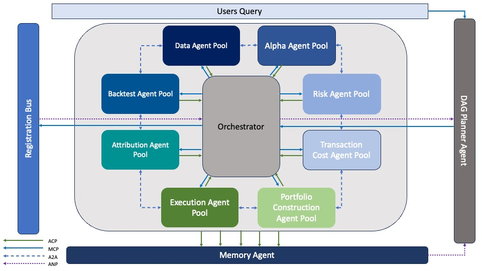

=============================
Overview
=============================

   System architecture of the protocol-driven multi-agent orchestration framework.

This project introduces a protocol-driven, modular architecture for orchestrating multi-agent systems in algorithmic trading. The design integrates dynamically generated execution graphs, functionally specialized agent pools, and memory-based feedback to support adaptive, interpretable, and scalable decision-making.

Inspired by agentic planning frameworks and distributed control theory, the system decomposes the trading lifecycle into reusable components—ranging from data ingestion and alpha modeling to portfolio construction and post-trade attribution. These agents are composed at runtime via a DAG Planner Agent and coordinated by a central Orchestrator.

Communication across the system is mediated by four protocol layers:

- **MCP** (Multi-agent Control Protocol): task dispatch and execution management
- **ACP** (Agent Communication Protocol): result feedback and synchronization
- **A2A** (Agent-to-Agent Protocol): peer-level data flow along DAG edges
- **ANP** (Agent Notification Protocol): broadcast alerts and asynchronous signaling

By enabling dynamic task routing and memory-informed learning, the framework provides a foundation for research and deployment of intelligent, multi-agent financial systems capable of long-term strategic adaptation.